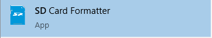
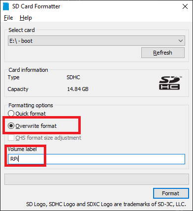

# IoT Central Device Training
## Module 01 - Setting up for Development

### Configuring the OS for the RPi (Raspbian)
Your first thing to get going is setting up  your Raspbian image onthe  SD card that you load into the MicroSD cart slot on the Raspberry Pi.

Here are the tools you need to install...

* The official SD Card Formatter from the SD Association. Install for your OS. [LINK: SD Crd Formatter](https://www.sdcard.org/downloads/formatter/)

* The tool called "balenaEtcher" which is used to copy your Raspbian image onto the formatted SD card. [LINK: balenaEtcher Download Page](https://www.balena.io/etcher/)

* The OS Image for the RPi. We will install the full package named "Raspbian Buster with desktop and recommended software" [LINK: Raspbian Buster Download Page](https://www.raspberrypi.org/downloads/raspbian/)

Now that you have all of that software installed, let's build our SD card for the RPi...

* Place your card into your SD slot on your computer and insure the system can see the card. DO NOT FORMAT IT if you are prompted by your Operating System, just dismiss the dialogs.
* Start the SD Card Formatter software you downloaded. 
* The dialog will open, find your SD card (make sure the right drive is selected) and choose the option to "Overwrite format" and give your image a name 

* 

### Enabling Capabilities on the RPi
### How to connect and SSH to your device
