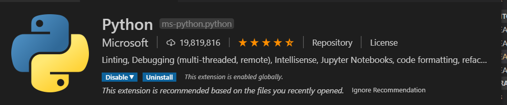
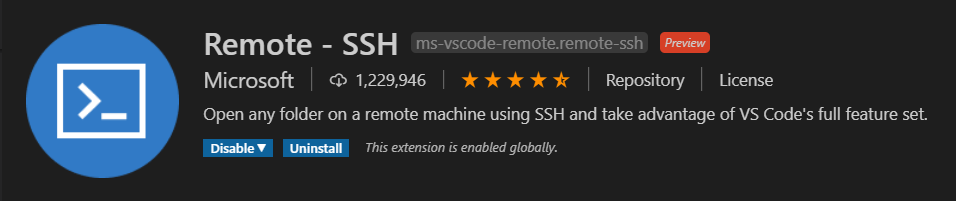
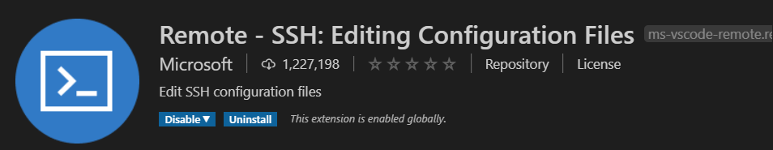

# IoT Central Device Training
## Module 03 - Setting up your Development Toolchain

### Install Git
Git is the tool we use for version control and management of software assets. Our workshop will use it to clone the modules and also to save anything if you want

[LINK: Git Installation Page](https://git-scm.com/book/en/v2/Getting-Started-Installing-Git)

### Install Visual Studio Code
This is the IDE we will use to write code, deploy to the RPi, etc. 

[LINK: Visual Studio Code Installation Page](https://code.visualstudio.com/download)

### Install Python
Pyhon is the language we will use to build applications for the Raspberry Pi

From the Python Org: 
* Python is powerful... and fast;
* plays well with others; 
* runs everywhere; 
* is friendly & easy to learn; 
* is Open.

[LINK: Python 3 Installation Page](https://www.python.org/downloads/)

### Upgrading pip
Pip is the package manager we will use to download packages

On Linux or macOS:
    pip install -U pip

On Windows:
    python -m pip install -U pip

### Install all the Tools in Vidual Studio Code
These are a set of tools we will use to develop our apps on the Raspberry Pi

